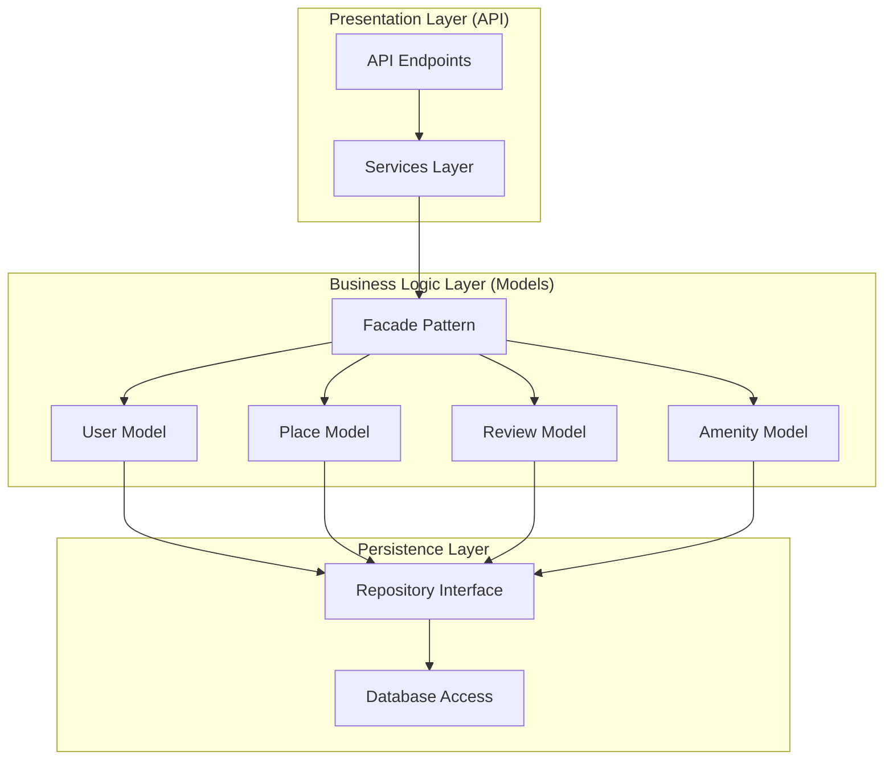
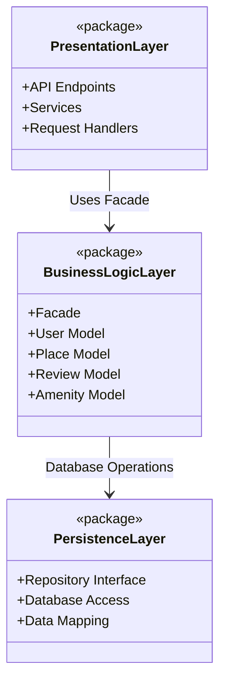

# Task 0: High-Level Package Diagram

## Overview
This document presents the high-level architecture of the HBnB Evolution application using a three-layer architecture pattern with the Facade design pattern facilitating communication between layers.

## Architecture Diagram

## Alternative Package Diagram View

## Layer Descriptions

### 1. Presentation Layer (Services/API)
**Responsibilities:**
- Handle HTTP requests and responses
- Validate input data
- Route requests to appropriate business logic
- Format responses for clients
- Implement RESTful API endpoints

**Components:**
- API Endpoints: RESTful routes for user interactions
- Services: Business operation orchestration
- Request/Response handlers

**Communication:**
The Presentation Layer interacts with the Business Logic Layer exclusively through the Facade pattern, ensuring loose coupling and separation of concerns.

### 2. Business Logic Layer (Models)
**Responsibilities:**
- Implement core business rules
- Define entity models and their behaviors
- Enforce data validation and constraints
- Manage entity relationships
- Coordinate operations across multiple entities

**Components:**
- **Facade**: Provides a unified interface for the Presentation Layer to interact with business logic
- **User Model**: Manages user registration, authentication, and profile operations
- **Place Model**: Handles property listings and their attributes
- **Review Model**: Manages user reviews for places
- **Amenity Model**: Handles amenity definitions and associations

**Design Pattern - Facade:**
The Facade pattern simplifies the interface between layers by:
- Providing a single entry point for the Presentation Layer
- Hiding the complexity of business logic implementation
- Coordinating operations across multiple models
- Reducing dependencies between layers

### 3. Persistence Layer
**Responsibilities:**
- Handle data storage and retrieval
- Manage database connections
- Implement CRUD operations
- Ensure data consistency and integrity
- Abstract database implementation details

**Components:**
- **Repository Interface**: Defines standard data access methods
- **Database Access**: Implements actual database operations
- **Data Mapping**: Converts between domain objects and database records

**Communication:**
The Business Logic Layer accesses the Persistence Layer through the Repository interface, allowing for database implementation flexibility.

## Communication Flow

### Request Flow (Top to Bottom):
1. Client sends HTTP request to API endpoint (Presentation Layer)
2. API route handler validates input and calls appropriate Service
3. Service invokes Facade method (Business Logic Layer)
4. Facade coordinates with Model(s) to execute business logic
5. Model(s) interact with Repository to persist/retrieve data (Persistence Layer)
6. Repository performs database operations

### Response Flow (Bottom to Top):
1. Repository returns data from database
2. Model processes and validates data
3. Facade aggregates results from multiple models if needed
4. Service formats data for API response
5. API sends HTTP response to client

## Benefits of This Architecture

1. **Separation of Concerns**: Each layer has distinct responsibilities
2. **Maintainability**: Changes in one layer minimally impact others
3. **Testability**: Layers can be tested independently
4. **Scalability**: Layers can be scaled independently based on load
5. **Flexibility**: Database or API implementation can change without affecting business logic
6. **Reusability**: Business logic can be reused across different presentation interfaces

## Facade Pattern Benefits

1. **Simplified Interface**: Single entry point reduces complexity
2. **Loose Coupling**: Presentation Layer doesn't need to know about individual models
3. **Flexibility**: Internal business logic can change without affecting API
4. **Centralized Control**: Business operations can be orchestrated efficiently
5. **Easier Testing**: Mock the Facade to test Presentation Layer independently

## Example Interaction

When a user registers:
1. POST /api/users → API Endpoint (Presentation)
2. API validates request → Calls UserService
3. UserService → Calls Facade.register_user()
4. Facade → Creates User model instance, validates business rules
5. User model → Calls Repository.save()
6. Repository → Persists to database
7. Success response flows back through layers to client

## Conclusion

This three-layer architecture with the Facade pattern provides a robust, maintainable, and scalable foundation for the HBnB Evolution application. The clear separation of concerns ensures that each layer can evolve independently while maintaining system integrity.
