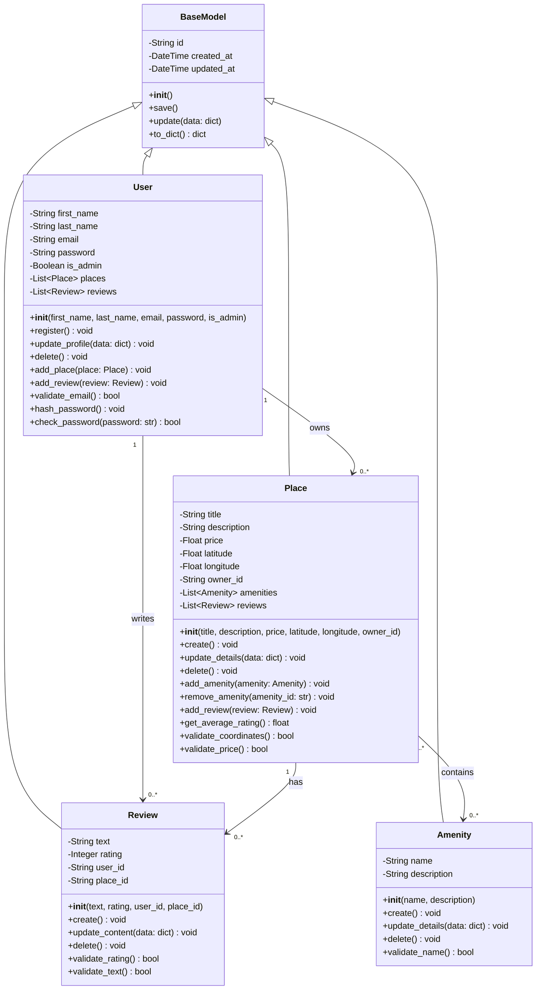

# Task 1: Detailed Class Diagram for Business Logic Layer

## Overview
This document presents a detailed class diagram for the Business Logic layer of the HBnB Evolution application, focusing on the core entities: User, Place, Review, and Amenity, along with their attributes, methods, and relationships.

## Complete Class Diagram

## Entity Descriptions

### BaseModel (Abstract Base Class)

**Purpose**: Provides common attributes and methods for all entities in the system.

**Attributes:**
- `id` (String): Unique identifier using UUID4 format
- `created_at` (DateTime): Timestamp when the entity was created
- `updated_at` (DateTime): Timestamp when the entity was last updated

**Methods:**
- `__init__()`: Initializes id, created_at, and updated_at
- `save()`: Updates the updated_at timestamp
- `update(data: dict)`: Updates entity attributes from a dictionary
- `to_dict()`: Converts entity to dictionary representation

**Design Rationale**:
- Implements DRY principle by centralizing common functionality
- Ensures all entities have audit trail (creation and update timestamps)
- Provides consistent interface for all business objects

---

### User Entity

**Purpose**: Represents a user in the system, who can be either a regular user or an administrator.

**Attributes:**
- `first_name` (String): User's first name
- `last_name` (String): User's last name
- `email` (String): User's email address (unique identifier for login)
- `password` (String): Hashed password for authentication
- `is_admin` (Boolean): Flag indicating if user has administrator privileges
- `places` (List of Place): List of places owned by the user
- `reviews` (List of Review): List of reviews written by the user

**Methods:**
- `__init__(first_name, last_name, email, password, is_admin=False)`: Constructor
- `register()`: Registers a new user in the system
- `update_profile(data: dict)`: Updates user profile information
- `delete()`: Removes user from the system
- `add_place(place: Place)`: Adds a place to user's property list
- `add_review(review: Review)`: Adds a review to user's review list
- `validate_email()`: Validates email format
- `hash_password()`: Hashes the password before storage
- `check_password(password: str)`: Verifies password during login

**Business Rules:**
- Email must be unique across all users
- Password must be hashed before storage
- Admin users have additional privileges
- A user can own multiple places
- A user can write multiple reviews

---

### Place Entity

**Purpose**: Represents a property listing in the system.

**Attributes:**
- `title` (String): Name/title of the place
- `description` (String): Detailed description of the place
- `price` (Float): Price per night
- `latitude` (Float): Geographic latitude coordinate
- `longitude` (Float): Geographic longitude coordinate
- `owner_id` (String): ID of the user who owns this place
- `amenities` (List of Amenity): List of amenities available at this place
- `reviews` (List of Review): List of reviews for this place

**Methods:**
- `__init__(title, description, price, latitude, longitude, owner_id)`: Constructor
- `create()`: Creates a new place listing
- `update_details(data: dict)`: Updates place information
- `delete()`: Removes place from the system
- `add_amenity(amenity: Amenity)`: Adds an amenity to the place
- `remove_amenity(amenity_id: str)`: Removes an amenity from the place
- `add_review(review: Review)`: Adds a review to the place
- `get_average_rating()`: Calculates average rating from all reviews
- `validate_coordinates()`: Validates latitude and longitude values
- `validate_price()`: Ensures price is positive

**Business Rules:**
- Each place must have an owner (user)
- Latitude must be between -90 and 90
- Longitude must be between -180 and 180
- Price must be a positive value
- A place can have multiple amenities
- A place can have multiple reviews

---

### Review Entity

**Purpose**: Represents a user's review of a place.

**Attributes:**
- `text` (String): Review comment/description
- `rating` (Integer): Numerical rating (1-5 scale)
- `user_id` (String): ID of the user who wrote the review
- `place_id` (String): ID of the place being reviewed

**Methods:**
- `__init__(text, rating, user_id, place_id)`: Constructor
- `create()`: Creates a new review
- `update_content(data: dict)`: Updates review text and/or rating
- `delete()`: Removes review from the system
- `validate_rating()`: Ensures rating is between 1 and 5
- `validate_text()`: Ensures review text is not empty

**Business Rules:**
- Rating must be between 1 and 5
- Each review is associated with one user and one place
- Review text cannot be empty
- A user can review multiple places
- A place can have multiple reviews

---

### Amenity Entity

**Purpose**: Represents a feature or amenity that can be associated with places.

**Attributes:**
- `name` (String): Name of the amenity (e.g., "WiFi", "Pool", "Parking")
- `description` (String): Detailed description of the amenity

**Methods:**
- `__init__(name, description)`: Constructor
- `create()`: Creates a new amenity
- `update_details(data: dict)`: Updates amenity information
- `delete()`: Removes amenity from the system
- `validate_name()`: Ensures amenity name is unique and not empty

**Business Rules:**
- Amenity names should be unique
- Multiple places can have the same amenity
- An amenity can be associated with multiple places

---

## Relationships

### 1. User → Place (One-to-Many)
- **Type**: Composition/Ownership
- **Multiplicity**: 1 User can own 0 or more Places
- **Description**: A user can list multiple properties. When a user is deleted, their places should be handled according to business rules (either deleted or transferred).

### 2. User → Review (One-to-Many)
- **Type**: Composition
- **Multiplicity**: 1 User can write 0 or more Reviews
- **Description**: A user can write multiple reviews for different places. Reviews are authored by users.

### 3. Place → Review (One-to-Many)
- **Type**: Aggregation
- **Multiplicity**: 1 Place can have 0 or more Reviews
- **Description**: A place can be reviewed by multiple users. Reviews are associated with places.

### 4. Place ↔ Amenity (Many-to-Many)
- **Type**: Association
- **Multiplicity**: A Place can have 0 or more Amenities; An Amenity can be associated with 0 or more Places
- **Description**: Places can have multiple amenities, and the same amenity type can exist in multiple places. This is a many-to-many relationship.

### 5. Inheritance: BaseModel → All Entities
- **Type**: Generalization/Inheritance
- **Description**: User, Place, Review, and Amenity all inherit from BaseModel, gaining id, created_at, updated_at attributes and common methods.

---

## SOLID Principles Applied

### Single Responsibility Principle (SRP)
- Each class has a single, well-defined purpose
- BaseModel handles common entity functionality
- Each entity focuses on its specific domain logic

### Open/Closed Principle (OCP)
- BaseModel is open for extension (inheritance) but closed for modification
- New entity types can be added by extending BaseModel
- Entity behaviors can be extended without modifying existing code

### Liskov Substitution Principle (LSP)
- All entities inherit from BaseModel and can be used interchangeably where BaseModel is expected
- Derived classes maintain the contract of the base class

### Interface Segregation Principle (ISP)
- Each entity has only the methods it needs
- No entity is forced to implement unnecessary methods

### Dependency Inversion Principle (DIP)
- Entities depend on abstractions (BaseModel) rather than concrete implementations
- High-level business logic doesn't depend on low-level details

---

## Validation Rules Summary

### User Validation
- Email: Must be valid format and unique
- Password: Minimum length, must be hashed
- Names: Cannot be empty

### Place Validation
- Title: Cannot be empty
- Price: Must be positive number
- Latitude: -90 to 90
- Longitude: -180 to 180

### Review Validation
- Rating: Integer between 1 and 5
- Text: Cannot be empty
- Must reference valid user and place

### Amenity Validation
- Name: Cannot be empty, should be unique
- Description: Cannot be empty

---

## Implementation Notes

1. All IDs use UUID4 format for uniqueness and security
2. Timestamps are automatically managed by BaseModel
3. Password hashing should use secure algorithms (bcrypt, argon2)
4. Relationships should maintain referential integrity
5. Cascade delete behavior should be defined for user and place deletions
6. The many-to-many relationship between Place and Amenity may require a junction table in the database

---

## Conclusion

This class diagram provides a comprehensive blueprint for the Business Logic layer, ensuring:
- Clear entity definitions with proper attributes and methods
- Well-defined relationships between entities
- Adherence to SOLID principles
- Comprehensive validation rules
- Audit trail for all entities through BaseModel

This design will guide the implementation in subsequent project phases.
