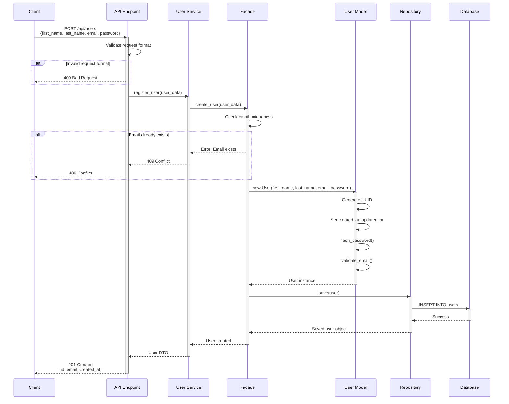
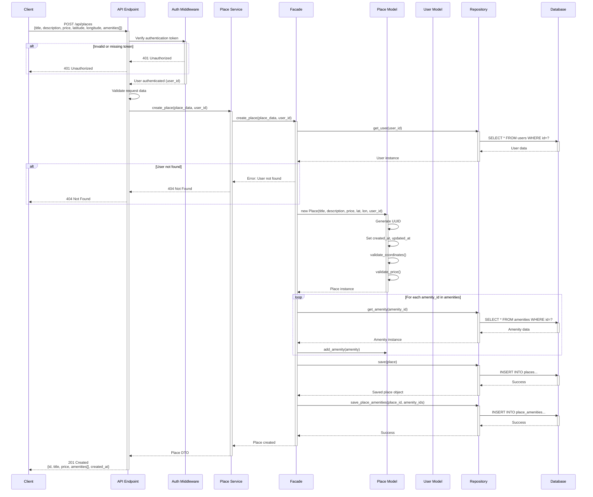
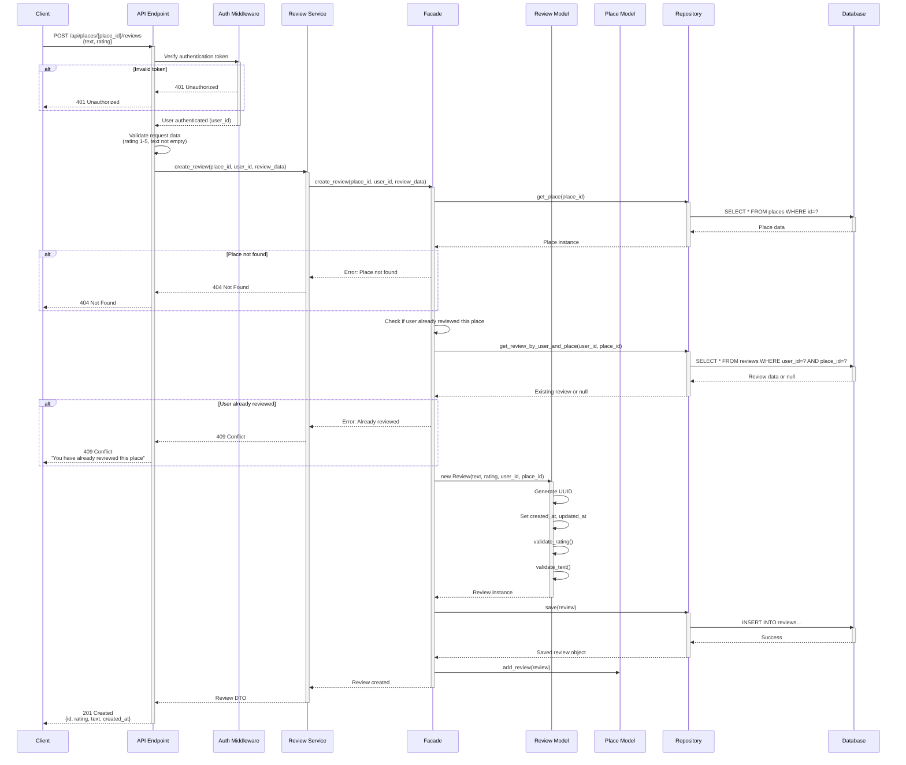
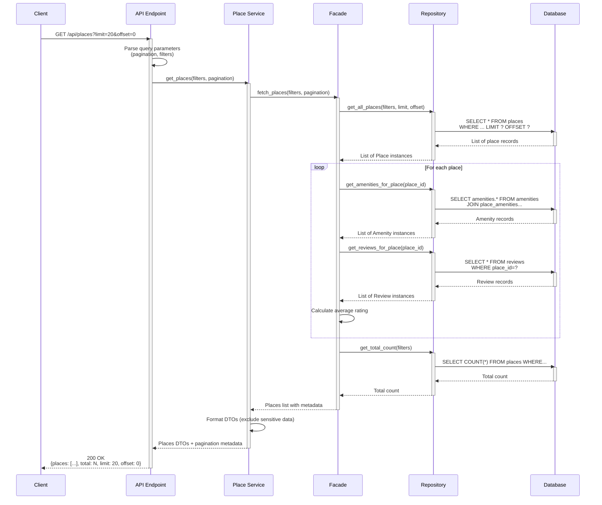

# Task 2: Sequence Diagrams for API Calls

## Overview
This document presents four sequence diagrams illustrating the interaction flow between the Presentation, Business Logic, and Persistence layers for key API operations in the HBnB Evolution application.

---

## 1. User Registration Sequence Diagram

### API Call: POST /api/users (User Registration)

### Flow Description:
1. **Client** sends POST request with user data to API endpoint
2. **API** validates request format
3. **Service** receives validated data and calls Facade
4. **Facade** checks if email is unique
5. **User Model** is instantiated with:
   - UUID generation
   - Password hashing
   - Email validation
   - Timestamp initialization
6. **Repository** persists user to database
7. **Response** flows back through layers
8. **Client** receives 201 Created with user information

---

## 2. Place Creation Sequence Diagram

### API Call: POST /api/places (Create Place)

### Flow Description:
1. **Client** sends POST request with place data
2. **Auth Middleware** verifies user authentication
3. **API** validates request data format
4. **Facade** verifies user exists
5. **Place Model** is instantiated with validation:
   - Coordinates validation
   - Price validation
   - UUID generation
6. **Facade** retrieves and associates amenities
7. **Repository** persists place and amenity associations
8. **Client** receives 201 Created with place details

---

## 3. Review Submission Sequence Diagram

### API Call: POST /api/places/{place_id}/reviews (Submit Review)

### Flow Description:
1. **Client** sends POST request to review a place
2. **Auth Middleware** verifies user is authenticated
3. **API** validates review data (rating range, text presence)
4. **Facade** verifies place exists
5. **Facade** checks if user has already reviewed this place
6. **Review Model** is created with validation:
   - Rating must be 1-5
   - Text must not be empty
7. **Repository** persists review
8. **Place** is updated with new review reference
9. **Client** receives 201 Created with review details

---

## 4. Fetching List of Places Sequence Diagram

### API Call: GET /api/places (Fetch All Places)

### Flow Description:
1. **Client** sends GET request with optional filters and pagination
2. **API** parses query parameters
3. **Service** requests places from Facade
4. **Repository** queries database with filters and pagination
5. **Facade** enriches each place with:
   - Associated amenities
   - Reviews
   - Average rating calculation
6. **Repository** also fetches total count for pagination
7. **Service** formats data transfer objects
8. **Client** receives 200 OK with paginated places list

---

## Common Patterns Across All Sequences

### 1. Layer Communication
All diagrams demonstrate the three-layer architecture:
- **Presentation** (API, Services): Input validation and response formatting
- **Business Logic** (Facade, Models): Business rules and entity management
- **Persistence** (Repository, Database): Data storage and retrieval

### 2. Facade Pattern
The Facade serves as the single entry point from Services to Business Logic, coordinating:
- Multiple model interactions
- Business rule validation
- Data integrity checks

### 3. Error Handling
Each sequence includes error scenarios:
- Authentication failures (401)
- Not Found errors (404)
- Conflict errors (409)
- Bad Request errors (400)

### 4. Validation Layers
Validation occurs at multiple levels:
- **API Layer**: Format and schema validation
- **Business Logic**: Business rules and constraints
- **Model Layer**: Entity-specific validation

### 5. Security Considerations
- Authentication middleware for protected endpoints
- Password hashing before storage
- Sensitive data filtering in responses

---

## Additional API Calls (Brief Overview)

### 5. Update User Profile: PUT /api/users/{user_id}
- Authenticates user
- Validates update data
- Checks user owns the profile (or is admin)
- Updates user model
- Persists changes

### 6. Delete Place: DELETE /api/places/{place_id}
- Authenticates user
- Verifies ownership
- Cascades deletion to reviews
- Removes amenity associations
- Deletes place

### 7. Get Place Details: GET /api/places/{place_id}
- Fetches place by ID
- Loads associated amenities
- Loads reviews with user information
- Calculates statistics (avg rating, review count)
- Returns enriched place object

### 8. List User's Places: GET /api/users/{user_id}/places
- Optionally authenticates (public profile)
- Fetches all places owned by user
- Includes basic amenity and review info
- Supports pagination

---

## Conclusion

These sequence diagrams provide a comprehensive view of the interaction flows in the HBnB Evolution application, demonstrating:

1. **Clear separation of concerns** across three layers
2. **Proper use of the Facade pattern** for coordinating business logic
3. **Robust error handling** at each layer
4. **Data validation** at multiple levels
5. **Security considerations** with authentication and authorization
6. **Efficient data retrieval** with proper database queries

These diagrams will serve as implementation guides for the development team, ensuring consistent architecture and interaction patterns throughout the application.
